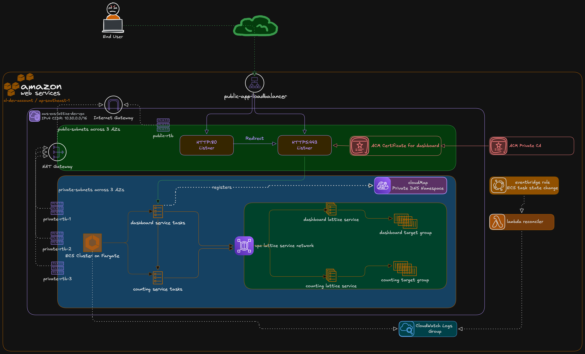

# ECS Service Discovery with VPC Lattice on ECS Fargate

## Project Description

This repository provides Terraform infrastructure for deploying a secure, highly available ECS Fargate application on AWS using VPC Lattice and Cloud Map for service discovery. It provisions a public HTTPS entry point for the dashboard service, private service-to-service connectivity for internal workloads, and optional ACM Private CA integration to support stronger internal trust and mTLS-ready designs.

The stack is intended for teams that need AWS-native service discovery, resilient multi-AZ deployment, controlled east-west traffic, and a clear foundation for encrypted internal communication without introducing a separate service mesh.

## Summary

This project deploys two ECS services, counting and dashboard, using AWS-native components:

- Service discovery with Cloud Map and VPC Lattice DNS
- Fault tolerance with multi-AZ private subnets and ECS service recovery
- Encrypted traffic with public ALB HTTPS and internal certificate foundations through ACM and Private CA
- Optional EventBridge + Lambda reconciler for Lattice target registration fallback
- Explicit VPC Lattice IAM auth policies to enforce least-privilege invoke access

The public entrypoint is the dashboard Application Load Balancer.
Internal service-to-service traffic is handled through VPC Lattice and private networking.

## Architecture

- Internet to Public ALB (HTTPS)
- Public ALB to Dashboard ECS tasks (private subnets)
- Dashboard and Counting service discovery through Cloud Map and VPC Lattice
- VPC Lattice service network for internal routing and policy control
- Optional ACM Private CA and service certificates for internal trust model

## Diagram


## Deployment Flow

1. Prepare configuration

	- Go to project folder
	- Copy terraform.tfvars.example to terraform.tfvars
	- Set ECR image URIs for counting and dashboard
	- Set dashboard_alb_certificate_arn for HTTPS
	- Confirm container ports:
	  - counting on 9003
	  - dashboard on 9002

2. Initialize Terraform
```bash
terraform init
```
3. Review plan
```bash
terraform plan -out=tfplan
```
4. Apply infrastructure
```bash
terraform apply tfplan
```
5. Verify service health

	- Check ECS desired and running counts for both services
	- Check ALB target health for dashboard target group
	- Check VPC Lattice target groups are active

6. Validate endpoint access

	- Test dashboard HTTPS URL from Terraform outputs
	- Confirm repeated requests return stable 200 responses

## Operations Notes

- Terraform uses terraform.tfvars by default when present.
- terraform.tfvars.example is a template only.
- If you change service ports, target groups may be replaced and draining can take a few minutes.
- If rollout gets unstable, scale dashboard desired count to 0, apply, then scale back to 1 and then 2.
